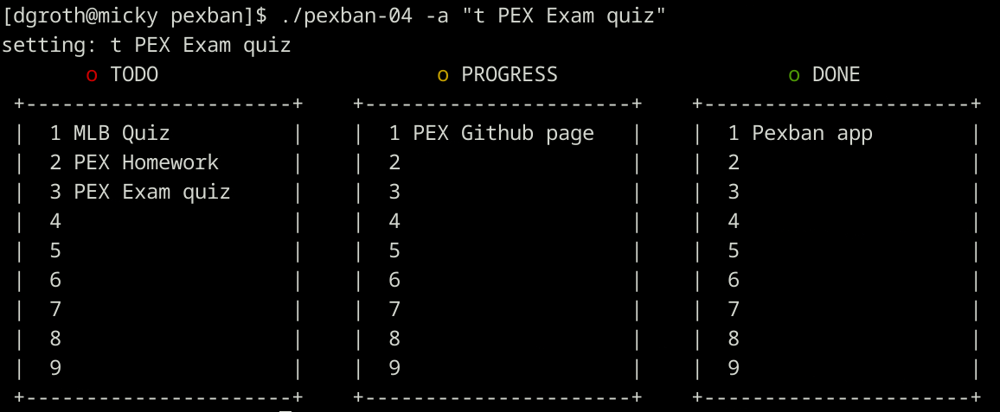

## Introduction

This project was  performed in the first 4 weeks of the cf the C++ part of the
course  "Programming  Expertise"  for Master  students  Bioinformatics  at the
University    of    Potsdam.    The    project    was    inspired    by    the
[Clikan](https://github.com/kitplummer/clikan)  project, a
Kanban board for the terminal written in Python.

## Outline

The topics were:

- __Week 1:__ - [pexban-01.cpp](pexban-01.cpp) printing out the three Kanban boards via interactive menu system
- __Week 2:__ - [pexban-02.cpp](pexban-02.cpp) adding and deleting items to the three boards
- __Week 3:__ - [pexban-03.cpp](pexban-03.cpp) moving items between boards and storing data in the users home directory
- __Week 4:__ - [pexban-04.cpp](pexban-04.cpp) implementing    command   line   options   using   the
                [popl](https://github.com/badaix/popl) command line parsing library

Week 3 and 4 uses as well  the  `pex::get_home_directory`  function  defined  in
[pex.cpp](pex.cpp) which was created to demonstrate the use of a namespace.

## Screenshot



## Compilation

Usually compilation using g++ like this:

```
g++ pexban-01.cpp -o pexban-01
g++ pex.cpp pexban-04.cpp pexban-04
```

Data will be saved in a file `~/.config/pexban/items.txt`.


