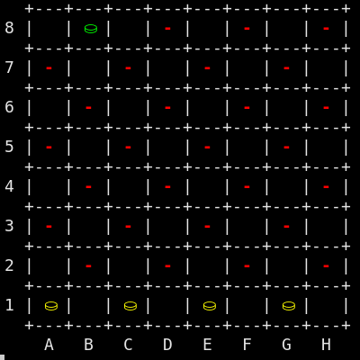
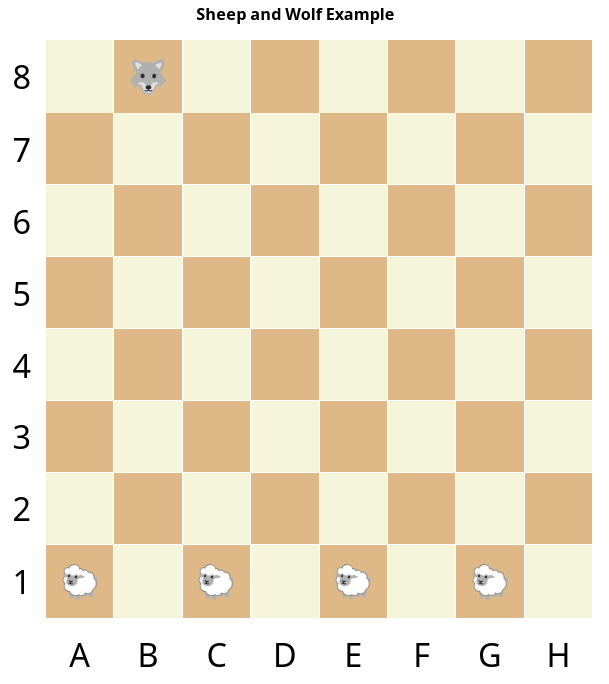

## Introduction

This was a series  of  exercises  in  Summer  semester  2023,  implementing  a
board game called Sheeps and Wolf as a terminal  application  and as well with
HTML output where the board was updated automatically.

## Files

-  [sheeps-01.cpp](sheeps-01.cpp)  - flexible board function which can print a
   board and stones with any size to the terminal
-  [sheeps-02.cpp](sheeps-02.cpp)  -  extending  the  application  code to use
   object oriented programming with public function display, using typedef and
   enum as features, implementing the move functon to move a stone
-  [sheeps-03.cpp](sheeps-03.cpp),           [SheepSaver.cpp](SheepSaver.cpp),
   [SheepSaver.hpp](SheepSaver.hpp) extending the application to save the game
   as a HTML file which is self updating.

## Terminal application

## HTML display

